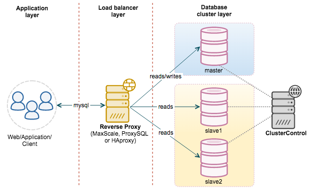

<div align="center">
    <h1>
        MbBlog
    </h1>
    
</div>

<!-- GFM-TOC -->
* [How to Use](#how-to-use)
* [缓存](#缓存)
    * [热点微博](#热点微博)
    * [Reids 和 Memcache](#reids-和-memcache)
    * [Redis 配置](#redis-配置)
    * [实现](#实现)
    * [业务上的折中](#业务上的折中)
    * [序列化方式的选择](#序列化方式的选择)
* [主从架构](#主从架构)
    * [主从复制](#主从复制)
    * [读写分离](#读写分离)
    * [主从复制配置](#主从复制配置)
* [交互设计](#交互设计)
    * [登录时异步修改用户头像](#登录时异步修改用户头像)
    * [异步删帖](#异步删帖)
* [性能测试](#性能测试)
<!-- GFM-TOC -->


## How to Use

- 用户名：root

- 密码：123

## 缓存

### 热点微博

微博内容具有读多写少的特性，这种场景下特别适合将数据进行缓存。MBlog 使用 Redis 缓存热点微博数据。

### Reids 和 Memcache

在项目开始的时候面临着 Redis 和 Memcache 的选择问题，它们之间的主要区别如下：

- Redis 有更好的分布式支持，而 Memcache 只能在客户端使用一致性 Hash 来支持分布式。
- Redis 具有 RDB 快照和 AOF 日志两种持久化特性，而 Memcache 没有持久化机制。
- Redis 的 Value 支持五种类型，而 Memcache 的 Value 只能是 String。
- Redis 会将很久没用的 KV 交换到磁盘上，而 Memchache 的数据一直在内存中。
- Memcache 为了完全去除磁盘碎片的影响，将内存分割成特定长度的块来存储数据，但是这种方式导致了内存利用率不高。例如块的大小为 128 bytes，只存储 100 bytes 的数据，那么剩下的 28 bytes 就浪费掉了。

考虑到项目需要使用多台缓存服务器，因此首选 Redis。虽然 Spring 整合了 Redis，使用 @Cacheable 等注解就可以使用 Redis 进行缓存，但是为了让缓存更可控，因此选择自己实现缓存功能。

### Redis 配置

首先需要对 Redis 进行配置，主要是两个方面：内存最大使用量以及缓存淘汰策略。

内存最大使用量在服务器能接受的范围内越大越好，一般要比热点数据大一些，因为 Reids 不仅要用来存储数据，还有存 Redis 运行过程的数据。

Redis 有五种缓存淘汰策略，为了选择一种适合项目的策略，需要先对每种策略进行一个了解。

NoEviction 和 TTL（Time to Live）不适合本项目的缓存系统，因为不淘汰和根据过期时间进行淘汰都不能保证留在缓存中的数据都尽可能使热点数据。Random 也和过期时间相关，并且随机化策略无法保证热点数据。LRU（least recently used） 策略将最近最少使用的数据进行淘汰，最近使用次数多的数据被认为是热点数据，因此将最近最少使用的数据淘汰之后，能在很大程度上保证在缓存中的数据都是热点数据。

|      策略       |                         描述                         |
| :-------------: | :--------------------------------------------------: |
|  volatile-lru   | 从已设置过期时间的数据集中挑选最近最少使用的数据淘汰 |
|  volatile-ttl   |   从已设置过期时间的数据集中挑选将要过期的数据淘汰   |
| volatile-random |      从已设置过期时间的数据集中任意选择数据淘汰      |
|   allkeys-lru   |       从所有数据集中挑选最近最少使用的数据淘汰       |
| allkeys-random  |          从所有数据集中任意选择数据进行淘汰          |
|   noeviction    |                     禁止驱逐数据                     |

LRU 除了在 Redis 中被当做缓存淘汰策略，它在很多场合都被使用，例如操作系统的页面置换算法可以使用 LRU，这是因为页面置换算法也相当于一个缓存淘汰算法。Java 里面的 LinkedHashMap 可以保存插入键值对的 LRU，在 Java 程序中就可以使用 LinkedHashMap 来实现类似的缓存淘汰功能。

实现 LRU 其实也很简单，就是通过一个链表来维护顺序，在访问一个元素时，就将元素移到链表头部，那么链表尾部的元素就是最近最少使用的元素，可以将它淘汰。笔者自己也实现了一个简单的 LRU，源码：[LRU](https://github.com/CyC2018/Algorithm/blob/master/Caching/src/LRU.java)

### 实现

为了实现缓存功能，需要修改获取微博和添加微博的实现代码。

在获取微博的代码中，首先从 Redis 中获取，如果获取失败就从数据库中获取。

其中 BlogCacheDao 实现了缓存的获取和添加功能，CacheHitDao 用来记录缓存的命中次数和未命中次数，这是为了对系统进行监控，从而对缓存进行优化，并且能够及时发现缓存穿透和缓存雪崩等问题。

在添加微博到数据库的同时也要将它添加到 Redis 中，这是因为数据库使用的是主从架构来实现的读写分离，主从同步过程需要一定的时间，这一段时间主备数据库是不一致的。如果读请求发送到从数据库，那么就无法读取到最新的数据。如果在写的同时将数据添加到缓存中，那么读最新数据的请求就不会发送到从服务器，从而避免了主备服务器在同步期间的不一致。

```java
@Override
public Blog getBlogByBlogId(int blogId)
{
    Blog blog = blogCacheDao.getBlog(blogId);
    if (blog != null) {
        cacheHitDao.hit();           /* 缓存命中 */
    } else {
        blog = blogMapper.selectByPrimaryKey(blogId);
        cacheHitDao.miss();          /* 缓存未命中 */
        blogCacheDao.addBlog(blog);  /* 放入缓存 */
    }
    return blog;
}

@Override
public void addBlog(int userId, String content)
{
    Blog blog = new Blog();
    blog.setUserid(userId);
    blog.setContent(content);
    blog.setPublishtime(new Date());
    blogMapper.insert(blog);
    blogCacheDao.addBlog(blog);
}
```

### 业务上的折中

如果微博内容不能被修改，那么就可以避免缓存不一致的问题，各级的缓存都能保证是有效的缓存。

微博内容往往是很简单的，如果发布之后发现有错，重新发布一次的代价不会很高。并且微博内容往往具有时效性，也就是人们只会去阅读近期的微博，那么一个用户想要修改很久之前的微博内容就没有太多的意义，因为很少人能看到。

本项目在业务上进行折中，不提供修改微博的功能，这能大大提高系统的性能。

从中可以发现，有时候无法克服的技术难题，通过在业务上进行简单调整，往往很容易就能解决。

### 序列化方式的选择

在实现 Redis 缓存功能时，最开始选择使用 Java 自带的序列化方式将一个对象转换成字节数组然后存储，但是后来意识到这样序列化得到的内容有很多是类定义的内容，这部分内容完全没必要存入缓存中，只需要将几个关键字段拼接成字符串存储即可，实现代码如下：

```java
public class SerializeUtil {

    private static final String separator = "/////";

    public static String writeBlogObject(Blog blog) 
    {
        StringBuilder s = new StringBuilder();
        s.append(blog.getUserid()).append(separator);
        s.append(blog.getBlogid()).append(separator);
        s.append(DateUtil.formatDate(blog.getPublishtime())).append(",");
        s.append(blog.getContent());
        return s.toString();
    }

    public static Blog readBlogObject(String s) 
    {
        Blog blog = new Blog();
        String[] token = s.split(separator);
        blog.setUserid(Integer.valueOf(token[0]));
        blog.setBlogid(Integer.valueOf(token[1]));
        blog.setPublishtime(DateUtil.parseDate(token[2]));
        blog.setContent(token[3]);
        return blog;
    }
}

```

为了验证两种序列化方式的时间和空间上的开销，进行了两个基准测试，测试代码在 com.cyc.benchmark.SerializeTest.java 中，因为比较长就不贴代码了。

首先模拟一个微博对象，存放一定的微博内容，然后使用 Java 自带的序列化方式和拼接的方式分别运行 1000000 次的序列化和反序列化，统计存储所需要的字节数和总时间，如下：

|                | Java 序列化 | 字段拼接 |
| :------------: | :---------: | :------: |
| 存储所需字节数 |     298     |    48    |
|   运行时间/s   |   14.301    |  4.113   |

可以发现字段拼接方式实现的序列化方式，无论在空间上还是在时间上都比 Java 自带的序列化方式要好很多，因此项目使用自己实现的字段拼接方法。

至于 JSON 序列化方式，因为它也存储着字段的名称，因此很容易就能知道在空间开销上比字段拼接方式要高很多。


## 主从架构

### 主从复制


MySQL 主从复制主要涉及三个线程：binlog 线程、I/O 线程和 SQL 线程。

-   **binlog 线程**  ：负责将主服务器上的数据更改写入二进制文件（binlog）中。
-   **I/O 线程**  ：负责从主服务器上读取二进制日志文件，并写入中继日志中。
-   **SQL 线程**  ：负责读取中继日志并重放其中的 SQL 语句。

### 读写分离



主服务器用来处理写操作以及最新的读请求，而从服务器用来处理读操作。

读写分离常用代理方式来实现，代理服务器接收应用层传来的读写请求，然后决定转发到哪个服务器。

MySQL 读写分离能提高性能的原因在于：

- 主从服务器负责各自的读和写，极大程度缓解了锁的争用；
- 从服务器可以配置 MyISAM 引擎，提升查询性能以及节约系统开销；
- 增加冗余，提高可用性。

### 主从复制配置

#### 创建复制账号

在主从服务器都创建用于复制的账号，并且账号必须在 master-host 和 slave-host 都进行授权，也就是说以下的命令需要在主从服务器上都执行一次。

```
mysql > grant all privileges on *.* to repl@'master-host' identified by 'password';
mysql > grant all privileges on *.* to repl@'slave-host' identified by 'password';
mysql > flush privileges;
```

完成后最好测试一下主从服务器是否能连通。

```
mysql -u repl -h host -p
```

#### 配置 my.cnf 文件

主服务器

```
[root]# vi /etc/my.cnf

[mysqld]
log-bin  = mysql-bin
server-id = 10
```

从服务器

```
[root]# vi /etc/my.cnf

[mysqld]
log-bin          = mysql-bin
server-id        = 11
relay-log        = /var/lib/mysql/mysql-relay-bin
log-slave-updates = 1
read-only         = 1
```

重启 MySQL

```
[root]# service mysqld restart;
```

《高性能 MySQL》书上的配置文件中使用的是下划线，例如 server_id，使用这种方式在当前版本的 MySQL 中不能使用。

#### 启动复制

先查看主服务器的二进制文件名：

```
mysql > show master status;
```

```
+------------------+----------+--------------+------------------+
| File            | Position | Binlog_Do_DB | Binlog_Ignore_DB |
+------------------+----------+--------------+------------------+
| mysql-bin.000002 |      106 |              |                  |
+------------------+----------+--------------+------------------+
```

然后配置从服务器：

```
mysql > change master to master_host='master-host',            > master_user='repl',
      > master_password='password',
      > master_log_file='mysql-bin.000002',
      > master_log_pos=0;
```

在从服务器上启动复制：

```
mysql > start slave
```

查看复制状态，Slave_IO_Running 和 Slave_SQL_Running 必须都为 Yes 才表示成功。

```
mysql > show slave status\G;
*************************** 1. row ***************************
              Slave_IO_State: Waiting for master to send event
                  Master_Host:
                  Master_User: repl
                  Master_Port: 3306
                Connect_Retry: 60
              Master_Log_File: mysql-bin.000002
          Read_Master_Log_Pos: 106
              Relay_Log_File: mysql-relay-bin.000006
                Relay_Log_Pos: 251
        Relay_Master_Log_File: mysql-bin.000002
            Slave_IO_Running: Yes
            Slave_SQL_Running: Yes
            ...
```

## 交互设计

### 登录时异步修改用户头像

为了提高用户在登录时的使用体验，通过监听用户名输入框的 focusout 事件，当该事件发生时，通过 ajax 异步获取用户头像。

```js
var userNameInput = $("input[name=userName]");
userNameInput.focusout(function ()
{
    $.ajax({
            url: "getUserHeadPic.html",
            type: "post",
            dataType: "text",
            data: {
                userName: userNameInput.val()
            },
            success: function (headpic)
            {
                replaceHeadPic(headpic);
            }
    });
}
```

<div align="center">
    
</div>

### 异步删帖

考虑到用户在删帖后想继续浏览剩下的帖子，因此采用异步的方式进行删帖，删帖之后不需要刷新页面。

删帖成功之后，会将该帖子隐藏。为了更好的体验，隐藏过程设置了一个 200 毫秒的延迟，从而具有一个短暂的隐藏动画效果。

```js
var deleteBlog = $("#delete-blog");

deleteBlog.on("click", function ()
{
    var blogid = deleteBlog.attr("blogid");
    var blogDiv = $("#blog-" + blogid.toString());
    $.ajax({
        url: "editBlog.html",
        type: "post",
        dataType: "text",
        data: {
            blogId: blogid
        },
        success: function ()
        {
            blogDiv.hide(200);
        }
    });
})
```


<div align="center">
    
</div>

## 性能测试

使用 Apache 的 ab 工具来进行压力测试。

为了防止网络时延的影响，因此在服务器端运行 ab 工具进行测试。

使用以下命令来使用 ab 工具，其中 -c 参数为并发数，-n 参数为请求数，-k 参数表示持久连接，http://localhost/dblog 就是待测试的网站。

```
ab -c 1000 -n 5000 -k http://localhost/dblog
```

在使用 Redis 进行缓存以及使用主从架构来实现读写分离之前，进行以上测试得到的部分结果如下，可以看出可以每秒平均的请求数为 715.81。

```
Time taken for tests:  6.985 seconds
Total transferred:      2645529 bytes
HTML transferred:      1530306 bytes
Requests per second:    715.81 [#/sec] (mean)
```

而在使用 Redis 以及主从架构之后，测试的结果如下，每秒平均的请求数以及提高到了 4839.62，大大提高了网站的吞吐量。

```
Time taken for tests:  1.033 seconds
Total transferred:      2696313 bytes
HTML transferred:      1559682 bytes
Requests per second:    4839.62 [#/sec] (mean)
```
